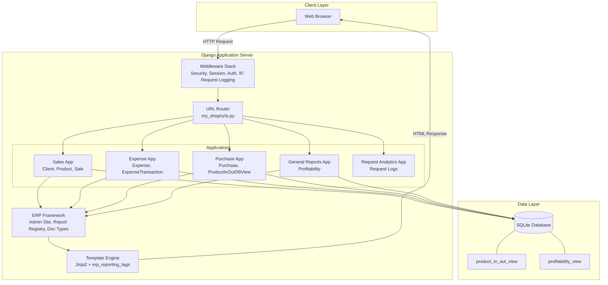
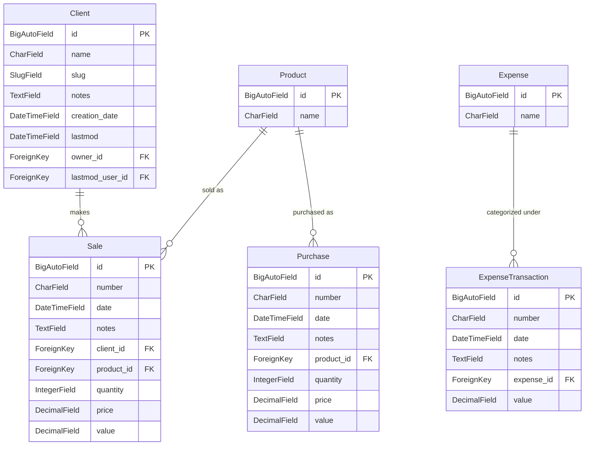

# CHAPTER FOUR: SYSTEM IMPLEMENTATION, RESULTS AND DISCUSSION

---

## 4.0 Introduction

This chapter presents the implementation of the My Shop Enterprise Resource Planning (ERP) system, a web-based application developed to manage sales, purchases, expenses, and financial reporting for small and medium-sized retail businesses. The chapter documents the development environment, system architecture, database design, module implementation, user interfaces, testing results, and a discussion of the findings obtained during the implementation process. Each module is described with reference to the actual source code, database models, templates, and configurations found in the codebase. Screenshots captured from the running system are included to provide visual evidence of the implemented features.

---

## 4.1 System Development Environment

### 4.1.1 Hardware Requirements

Hardware specification was not explicitly defined in the project documentation. The system was developed and tested on a machine with the following characteristics, as observed from the runtime environment:

| Component | Specification |
|-----------|---------------|
| Processor | Intel Core i5 (Family 6, Model 142, Stepping 9) |
| Architecture | 64-bit (AMD64) |
| RAM | Not specified in project files |
| Storage | Not specified in project files |
| Network | Local development (127.0.0.1) |

The system requires a machine capable of running Python 3.11 and a modern web browser. No specialized hardware is required.

### 4.1.2 Software Requirements

The software environment used for the implementation was extracted from the project configuration files (`requirements.txt`, `settings.py`, and the virtual environment):

| Software | Version | Purpose |
|----------|---------|---------|
| Operating System | Windows 10/11 | Development platform |
| Python | 3.11.9 | Programming language and runtime |
| Django | 4.2.30 | Web framework |
| SQLite | 3 (bundled with Python) | Database engine |
| Google Chrome | Latest | Browser for testing and screenshots |

**Third-Party Libraries:**

| Package | Version | Purpose |
|---------|---------|---------|
| django-erp-framework | 1.5.2 (dev) | Core ERP framework providing admin site, report registry, document types, and entity models |
| django-slick-reporting | 1.4.0 (dev) | Report generation engine with group-by, time-series, and crosstab capabilities |
| django-jazzmin | Installed | Admin theme providing modern Bootstrap 4 interface |
| crispy-bootstrap4 | Installed | Bootstrap 4 form rendering for django-crispy-forms |
| django-reversion | Installed | Object version tracking and history |
| django-request | Installed | HTTP request logging and analytics |
| django-ipware | Installed | Client IP address detection behind proxies |
| django-crequest | Installed | Current request middleware |
| tabular-permissions | Installed | Enhanced permission management interface |

The `django-erp-framework` and `django-slick-reporting` packages were installed as editable packages directly from the GitHub `develop` branch, as specified in `requirements.txt` (lines 6-7).

### 4.1.3 Development Tools and Technologies

**Backend Technologies:**
- Python 3.11 served as the primary programming language.
- Django 4.2 provided the web framework, including ORM, URL routing, template engine, middleware, and authentication.
- SQLite was used as the database engine for development, chosen for its zero-configuration setup.
- Django's built-in authentication system was extended with custom middleware for IP detection.

**Frontend Technologies:**
- Django's template engine with Jinja2-style syntax rendered all HTML pages.
- Bootstrap 4 (via Jazzmin admin theme) provided the responsive CSS framework.
- jQuery was used for DOM manipulation and AJAX requests.
- DataTables.net rendered interactive, sortable, and searchable tables within report widgets.
- Highcharts rendered pie charts, column charts, and line charts for report visualizations.
- Select2 enhanced dropdown selects with search functionality.

**Supporting Tools:**
- Git was used for version control.
- PowerShell was the command-line interface for running management commands.
- Google Chrome (headless mode) was used for capturing system screenshots.

---

## 4.2 System Architecture and Design Implementation

### 4.2.1 Overall System Architecture

The system follows the Model-View-Template (MVT) architectural pattern inherent to Django. The architecture consists of four layers:

1. **Presentation Layer:** HTML templates rendered by Django's template engine, styled with Bootstrap 4 (Jazzmin theme) and enhanced with JavaScript (jQuery, DataTables, Highcharts).
2. **Application Layer:** Django views (both function-based and class-based) process HTTP requests, apply business logic, and return responses.
3. **Data Access Layer:** Django's Object-Relational Mapping (ORM) handles all database operations through model definitions.
4. **Data Storage Layer:** SQLite database stores all application data, including two database views (`product_in_out_view` and `profitability_view`) that aggregate data across modules.

The request-response flow is as follows:

1. The user sends an HTTP request through a web browser.
2. Django's URL dispatcher routes the request to the appropriate view based on URL patterns defined in `my_shop/urls.py`.
3. Middleware processes the request (session management, authentication, IP detection, request logging).
4. The view queries the database through Django ORM models and renders a template with context data.
5. The response is returned to the user's browser.

**Architecture Diagram (Mermaid):**



*Figure 4.13: System Architecture Diagram*

### 4.2.2 System Component Description

The system comprises the following major components:

**1. Project Configuration (`my_shop/`)**

This package contains the Django project settings (`settings.py`), URL routing (`urls.py`), WSGI configuration (`wsgi.py`), and custom middleware (`middleware.py`). The `settings.py` file defines all installed applications, middleware stack, template configuration, database settings, Jazzmin theme customization, and ERP framework settings. The `SetCorrectIPMiddleware` class in `middleware.py` uses the `django-ipware` library to extract the real client IP address when the application is behind a proxy or CDN.

**2. Sales Application (`sales/`)**

Manages clients, products, and sales transactions. Provides the core entity models (`Client`, `Product`, `Sale`) and five report views (sales list, total product sales, time-series sales, percentage analysis, and client-product cross-tabulation).

**3. Expense Application (`expense/`)**

Manages expense categories and expense transactions. Provides two models (`Expense`, `ExpenseTransaction`) and five report views (detailed statement, total statement, monthly movement comparison, daily expenses, and daily totals).

**4. Purchase Application (`purchase/`)**

Manages purchase transactions and product movement tracking. Provides two models (`Purchase`, `ProductInOutDBView`) and three report views (average price, average price monthly, and product movement statement). The `ProductInOutDBView` model is mapped to a SQL view that unions sales and purchase data to calculate product balances.

**5. General Reports Application (`general_reports/`)**

Provides cross-domain profitability reporting by combining sales and expense data through a database view (`profitability_view`). Defines document types that classify sales as "plus-side" and expenses as "minus-side" for net profit calculation.

**6. Request Analytics Application (`request_analytics/`)**

Monitors HTTP traffic to the application. Provides a separate admin site (`RequestsDashboard`) with six report views for analyzing request patterns, error rates, and user agent distribution.

**7. ERP Framework (`erp_framework/`)**

The core framework provides the admin site infrastructure (`ERPFrameworkAdminSite`), report registry (`ReportRegistry`), document type system (`DocType`), entity models (`EntityModel`), and template tags for report rendering. This component is installed as a third-party package.

**8. Custom Templates (`templates/`)**

Contains overridden templates for the admin dashboard index (`admin/custom_index.html`), request analytics dashboard (`request_analytics/index.html`, `request_analytics/base.html`), and a standalone front-end dashboard (`front_end_dashboard.html`).

### 4.2.3 Database Implementation

The system uses SQLite as its database engine. The database was designed with five core entity tables, two database views for cross-domain reporting, and several Django framework tables.

**Entity-Relationship Diagram (Mermaid):**



*Figure 4.14: Entity-Relationship Diagram*

**Database Views:**

Two SQL views aggregate data across modules for reporting purposes:

1. **`product_in_out_view`** — Combines records from `sales_sale` (as sales/document type "sale") and `purchase_purchase` (as purchases/document type "purchase") into a unified product movement table. This view enables the Product Movement Statement report to display opening balance, debit quantity, credit quantity, total quantity, and closing balance for each product.

2. **`profitability_view`** — Combines records from `expense_expensetransaction` (as "expensetransaction") and `sales_sale` (as "saletransaction") into a unified profitability table. This view enables the Profitability Report to display net profit by comparing sales revenue against expense totals.

Both views are created through Django migrations using `migrations.RunSQL` and are mapped to unmanaged models (`managed = False`) so Django does not attempt to create or modify them.

**Key Database Tables:**

| Table | App | Records (Sample) | Purpose |
|-------|-----|-------------------|---------|
| `sales_client` | sales | Multiple | Customer records with name, slug, notes |
| `sales_product` | sales | 23+ | Product catalog |
| `sales_sale` | sales | Multiple | Sales transactions with auto-calculated value |
| `expense_expense` | expense | 19 | Expense categories |
| `expense_expensetransaction` | expense | Multiple | Individual expense records |
| `purchase_purchase` | purchase | Multiple | Purchase transactions |
| `product_in_out_view` | purchase | View | Unified product movement data |
| `profitability_view` | general_reports | View | Unified profitability data |

### 4.2.4 System Workflow

**Workflow 1: User Authentication**

1. The user navigates to the application root URL (`/`).
2. If not authenticated, the system redirects to the login page (`/accounts/login/`).
3. The user enters credentials (username and password).
4. Django's authentication backend validates credentials against the `auth_user` table.
5. On success, a session cookie is created and the user is redirected to the dashboard.
6. The `SetCorrectIPMiddleware` extracts the real client IP using `django-ipware`.
7. The `RequestMiddleware` from `django-request` logs the HTTP request.

**Workflow 2: Sales Transaction Processing**

1. The user navigates to Sales > Sales in the admin interface.
2. Clicking "Add Sale" presents a form with fields: number, date, client, product, quantity, and price.
3. The user selects a client and product from dropdown menus (populated from the database).
4. On save, the `Sale.save()` method automatically calculates `value = quantity * price`.
5. The transaction is recorded in the `sales_sale` table.
6. The record becomes available in sales reports and the profitability view.

**Workflow 3: Report Generation**

1. The user navigates to the dashboard or a specific report URL.
2. The `get_report` template tag retrieves the report class from the `ReportRegistry`.
3. The `get_widget` template tag renders a card with chart and table containers.
4. JavaScript (`slick_reporting.report_loader`) makes an AJAX request to the report URL.
5. The `ReportView` processes the request, applying date filters and form parameters.
6. The `ReportGenerator` queries the database, groups data, and computes aggregations.
7. The response is returned as JSON containing columns, data rows, chart settings, and metadata.
8. JavaScript renders the DataTable and Highcharts visualization.

**Workflow 4: Document Type Classification**

1. The system defines document types using `@doc_type_registry.register` decorator.
2. Sales transactions are classified as "saletransaction" (plus-side for profitability).
3. Expense transactions are classified as "expensetransaction" (minus-side for profitability).
4. Purchase transactions are classified as "purchase" (plus-side for product movement).
5. The report generator uses these classifications to calculate net balances.

---

## 4.3 System Modules Implementation

### 4.3.1 Authentication and User Management Module

**Purpose:** Provides secure access control to the system.

**Implementation:**

The system uses Django's built-in authentication framework (`django.contrib.auth`). The authentication flow is configured in `settings.py` with the following settings:

- `LOGIN_URL = '/accounts/login/'` — Login page URL.
- `LOGIN_REDIRECT_URL = reverse_lazy("admin:index", current_app="erp_framework_admin")` — Redirect after successful login.
- `AUTHENTICATION_BACKENDS = ['django.contrib.auth.backends.ModelBackend']` — Default authentication backend.

User management is handled through the ERP admin site. The `erp_framework.reporting.admin` module extends Django's `UserAdmin` with `ReportingPermissionInline`, allowing administrators to assign report-level permissions to individual users. Similarly, `ReportGroupPermissionInline` extends `GroupAdmin` for group-based report permissions.

The `SetCorrectIPMiddleware` (defined in `my_shop/middleware.py`) uses the `django-ipware` library to extract the real client IP address. This is configured with `IPWARE_META_PRECEDENCE_ORDER` in `settings.py` to check headers in order: `HTTP_CF_CONNECTING_IP`, `HTTP_X_FORWARDED_FOR`, `X_FORWARDED_FOR`, `HTTP_CLIENT_IP`, `HTTP_X_REAL_IP`, and others.

**Key Files:**
- `my_shop/settings.py` (lines 108-121 for password validators, lines 185-186 for login URLs)
- `my_shop/middleware.py` (SetCorrectIPMiddleware class)
- `erp_framework/reporting/admin.py` (CustomUserAdmin, CustomGroup)

### 4.3.2 Dashboard Module

**Purpose:** Provides a centralized overview of business metrics upon login.

**Implementation:**

The dashboard is rendered by the `ERPFrameworkAdminSiteBase.index()` method (defined in `erp_framework/admin/base.py`). The custom index template (`templates/admin/custom_index.html`) extends `erp_framework/base_site.html` and uses report template tags to embed interactive widgets.

The dashboard displays five report widgets:

1. **Expense Total Balances** — A pie chart and column chart showing expense distribution across categories, with a sortable DataTable.
2. **Product Movement Statement** — A table showing opening quantity, debit quantity, credit quantity, total quantity, and closing quantity for each product.
3. **Product Client Sales Cross Tab** — A cross-tabulation matrix showing total sales per product per client.
4. **Profitability Report Monthly** — A column chart showing monthly profitability trends with total line.
5. **Sales List** — A detailed list of recent sales transactions with client, product, quantity, price, and value.

Each widget is rendered using the `` and `` template tags from `erp_reporting_tags`. The widgets load data asynchronously via AJAX requests to the report API endpoints.

The system also provides a separate Requests Dashboard at `/requests-dashboard/` implemented as a distinct `ERPFrameworkAdminSite` instance (`RequestsDashboard` in `request_analytics/sites.py`). This dashboard uses its own template (`request_analytics/index.html`) and displays HTTP request analytics.

**Key Files:**
- `templates/admin/custom_index.html`
- `erp_framework/admin/base.py` (index method)
- `request_analytics/sites.py` (RequestsDashboard)
- `request_analytics/views.py` (Dashboard view)

### 4.3.3 Inventory/Product Management Module

**Purpose:** Manages the product catalog shared across sales and purchase operations.

**Implementation:**

The `Product` model is defined in `sales/models.py` with a single `name` field (`CharField`, max_length=100). Products are registered with the ERP admin site using the default `ModelAdmin` class.

Products serve as the central entity linking sales and purchases. The `Sale` model references `Product` via a ForeignKey, as does the `Purchase` model (from `purchase/models.py`). This shared reference enables the Product Movement Statement report to track product flow across both sales (outgoing) and purchases (incoming).

The `ProductInOutDBView` model (defined in `purchase/models.py`) provides a unified view of product movement by combining sales and purchase records through a SQL `UNION ALL` query. This view is mapped to the `product_in_out_view` database view and is used by the `ProductMovementStatement` report class.

Product stock levels are not directly stored in a separate inventory table. Instead, they are calculated dynamically through the `ProductInOutDBView` which computes debit (purchases) and credit (sales) quantities.

**Key Files:**
- `sales/models.py` (Product class, line 14)
- `purchase/models.py` (ProductInOutDBView class, line 35)
- `purchase/reports.py` (ProductMovementStatement class, line 56)

### 4.3.4 Sales Management Module

**Purpose:** Records and manages sales transactions between the business and its clients.

**Implementation:**

The module defines three models:

1. **`Client`** — Extends `EntityModel` from the ERP framework. Inherits fields: `name`, `slug`, `notes`, `creation_date`, `lastmod`, `owner`, `lastmod_user`. Registered with `EntityAdmin` which provides enhanced list display (`get_enhanced_obj_title`, `slug`, `notes`, `get_history_link`), date hierarchy on `creation_date`, and search by `name` and `slug`.

2. **`Product`** — Simple model with `name` field.

3. **`Sale`** — Core transaction model with fields: `number` (CharField), `date` (DateTimeField), `notes` (TextField), `client` (ForeignKey to Client), `product` (ForeignKey to Product), `quantity` (IntegerField), `price` (DecimalField), `value` (DecimalField, auto-calculated). The `save()` method computes `value = quantity * price` before persisting to the database.

The `SaleAdmin` class (in `sales/admin.py`) configures the admin interface with list display showing all fields, filters by client, product, and date, search by number and client/product name, and date hierarchy on the `date` field. The `value` field is set as read-only since it is auto-calculated.

Five report views are registered for the sales module:

| Report Class | Base Model | Purpose |
|-------------|------------|---------|
| `SaleListReportView` | (none) | Detailed list of all sales |
| `TotalProductSales` | Product | Total sales value grouped by product |
| `TotalProductSalesTimeSeries` | Product | Monthly time-series of product sales |
| `TotalProductSalesTimeSeriesWithPercentage` | (none) | Time-series with percentage contribution |
| `ProductClientSalesCrossTab` | Product | Cross-tab of products vs clients |

**Key Files:**
- `sales/models.py` (Client, Product, Sale)
- `sales/admin.py` (EntityAdmin, SaleAdmin)
- `sales/reports.py` (five report classes)
- `sales/management/commands/create_entries.py` (sample data generation)

### 4.3.5 Purchase Management Module

**Purpose:** Records purchase transactions and tracks product movement (inbound and outbound).

**Implementation:**

The module defines two models:

1. **`Purchase`** — Mirrors the Sale model structure with fields: `number`, `date`, `notes`, `product` (ForeignKey to `sales.Product`), `quantity`, `price`, `value` (auto-calculated). The `save()` method computes `value = quantity * price`.

2. **`ProductInOutDBView`** — An unmanaged model (`managed = False`, `db_table = "product_in_out_view"`) that maps to a SQL view combining sales and purchase data. Fields: `date`, `doc_type` (CharField indicating "sale" or "purchase"), `product` (ForeignKey), `quantity`, `price`, `value`.

The SQL view is created through a migration (`purchase/migrations/0002_productinoutdbview.py`) using `migrations.RunSQL`:
```sql
CREATE VIEW product_in_out_view AS
SELECT id, date, 'sale' AS doc_type, product_id, quantity, price, value FROM sales_sale
UNION ALL
SELECT id, date, 'purchase' AS doc_type, product_id, quantity, price, value FROM purchase_purchase
```

A `DocType` named "purchase" is registered with the document type registry, classifying `Product` on the plus-side. This enables the `ProductMovementStatement` report to calculate opening balances, debit quantities (purchases), credit quantities (sales), and closing balances.

Three report views are registered:

| Report Class | Purpose |
|-------------|---------|
| `ProductAveragePrice` | Average purchase price grouped by product |
| `ProductAveragePriceMonthly` | Monthly time-series of average prices with charts |
| `ProductMovementStatement` | Complete product flow with opening/closing balances |

**Key Files:**
- `purchase/models.py` (Purchase, ProductInOutDBView)
- `purchase/admin.py` (PurchaseAdmin)
- `purchase/reports.py` (ProductAveragePrice, ProductAveragePriceMonthly, ProductMovementStatement)
- `purchase/management/commands/create_purchase_entries.py`

### 4.3.6 Expense Management Module

**Purpose:** Tracks business expenses through categorized transactions.

**Implementation:**

The module defines two models:

1. **`Expense`** — Represents an expense category with a `name` field. Has Meta options for verbose name and plural form.

2. **`ExpenseTransaction`** — Individual expense records with fields: `number` (CharField), `date` (DateTimeField), `notes` (TextField), `expense` (ForeignKey to Expense with `on_delete=PROTECT` to prevent deletion of categories with existing transactions), `value` (DecimalField).

The `ExpenseTransactionAdmin` class provides list display, filters by expense category, date hierarchy on `date`, and search by number and notes.

Five report views are registered:

| Report Class | Slug | Purpose |
|-------------|------|---------|
| `ExpensesStatement` | (default) | Detailed transaction list |
| `ExpensesTotalStatement` | (default) | Aggregated totals by category with pie and column charts |
| `ExpenseMovementTimeComparison` | (default) | Monthly time-series comparison |
| `ExpenseMovementDaily` | `expenses_daily` | Daily breakdown by category (last 14 days) |
| `ExpenseMovementDaily2` | `expenses_daily_total` | Daily totals without category grouping |

The `ExpenseMovementDaily` report uses a custom `get_form_initial()` method to set default date range to the last 14 days.

**Key Files:**
- `expense/models.py` (Expense, ExpenseTransaction)
- `expense/admin.py` (ExpenseAdmin, ExpenseTransactionAdmin)
- `expense/reports.py` (five report classes)

### 4.3.7 Reporting and Analytics Module

**Purpose:** Provides cross-domain financial reporting and HTTP request analytics.

**Implementation:**

**Profitability Reporting:**

The `general_reports` application defines a `Profitability` model mapped to a SQL view (`profitability_view`) that unions sales and expense data. The view is created through a migration:

```sql
CREATE VIEW profitability_view AS
SELECT 'expensetransaction' AS type, date, value FROM expense_expensetransaction
UNION ALL
SELECT 'saletransaction', date, value FROM sales_sale;
```

Two document types are registered:
- "saletransaction" — Sales on the plus-side of profitability.
- "expensetransaction" — Expenses on the minus-side of profitability.

This classification enables the `ProfitabilityReport` to calculate net profit as the difference between sales revenue and expense totals.

**Request Analytics:**

The `request_analytics` application uses the `django-request` package to log all HTTP requests. A separate admin site (`RequestsDashboard`) is configured at `/requests-dashboard/` with its own base template and index page.

Six report views are registered for request analytics:

| Report Class | Purpose |
|-------------|---------|
| `RequestLog` | Detailed request log with filtering |
| `RequestCountByPath` | Request count grouped by URL path (success only) |
| `RequestErrorCountByPath` | Error count (HTTP 500) by path |
| `RequestCountByReferer` | Count by path |
| `RequestCountByPathTimeSeries` | Time-series of request counts |
| `RequestsCountByUserAgent` | Count by user agent with pie chart |

The `RequestLogForm` (in `request_analytics/forms.py`) provides custom filtering by date range, HTTP method, response status code, security (HTTPS vs HTTP), and an option to show only other users' requests.

**Key Files:**
- `general_reports/models.py` (Profitability)
- `general_reports/reports.py` (ProfitabilityReport, ProfitabilityReportMonthly)
- `request_analytics/erp.py` (six report classes)
- `request_analytics/forms.py` (RequestLogForm)
- `request_analytics/sites.py` (RequestsDashboard)

### 4.3.8 Document Type System

**Purpose:** Classifies transactions for balance and profitability calculations.

**Implementation:**

The ERP framework provides a document type registry (`doc_type_registry`) that classifies transactions as plus-side or minus-side relative to a base model. The following document types are registered:

| Doc Type Name | Class | Plus-Side | Minus-Side | App |
|--------------|-------|-----------|------------|-----|
| `purchase` | `SalesTransaction` | `Product` | — | purchase |
| `saletransaction` | `SalesTransaction` | `Profitability` | — | general_reports |
| `expensetransaction` | `ExpenseTransaction` | — | `Profitability` | general_reports |

This system enables the report generator to automatically determine which transactions increase or decrease balances without requiring manual filter definitions in each report.

---

## 4.4 Graphical User Interface Presentation

This section presents screenshots captured from the running system using Selenium WebDriver with Chrome in headless mode. Each figure is accompanied by a description of the interface elements and user interaction.

### Figure 4.1: Login Interface

**Filename:** `screenshots/figure_4_1_login.png`

**Interface:** Login page at `/accounts/login/`

**Description:** The login interface presents a clean, centered card layout provided by the Jazzmin admin theme. The page displays the following elements:

- The application brand name "My Shop ERP System" in the header.
- A welcome message instructing users on available credentials.
- Two input fields: Username and Password.
- A "Log in" button to submit credentials.
- A "Forgotten your password?" link (non-functional in development).

The login page uses Django's built-in `LoginView` with the Jazzmin theme template override. Authentication is handled by `django.contrib.auth.backends.ModelBackend`.

**User Interaction:** The user enters a username and password, then clicks "Log in". On success, the user is redirected to the main dashboard. On failure, an error message is displayed.

### Figure 4.2: Main Dashboard

**Filename:** `screenshots/figure_4_2_dashboard.png`

**Interface:** ERP Admin Dashboard at `/`

**Description:** The main dashboard is the primary interface after login. It displays:

- **Top Navigation Bar:** Contains links to "Requests Dashboard" and "Front end dashboard", along with the user profile dropdown.
- **Left Sidebar:** Navigation menu organized by application groups:
  - Authentication and Authorization (Groups, Users)
  - Expense (Expense Transactions, Expenses)
  - Purchase (Purchases)
  - Sales (Clients, Products, Sales)
  - Reports (Product, Expense, Profitability)
- **Main Content Area:** Report widgets arranged in a two-column grid layout:
  - **Left Column:** Expense Total Balances (with pie chart and table), Product Movement Statement (table), Product Client Sales Cross Tab.
  - **Right Column:** Profitability Report Monthly (column chart), Sales List (table).
- **Footer:** Jazzmin version and copyright information.

Each report widget is rendered as a card with a title, optional chart, and interactive DataTable with sorting, searching, and pagination capabilities.

**User Interaction:** The user can click on sidebar menu items to navigate to different sections, interact with report widgets (sort, search, paginate tables), and switch chart types using chart selectors where available.

### Figure 4.3: Sales List Interface

**Filename:** `screenshots/figure_4_3_sales_list.png`

**Interface:** Sales transaction list at `/admin/sales/sale/`

**Description:** The sales list interface displays all recorded sales transactions in a tabular format. The interface includes:

- **Filters Panel (right side):** Filter by Client, Product, and Date.
- **Search Bar:** Search by sale number, client name, or product name.
- **Action Dropdown:** Select and delete multiple records.
- **Table Columns:** Sale Number (clickable link), Date, Client, Product, Quantity, Price, Value.
- **Date Hierarchy:** Navigation links to filter by year, month, and day.
- **Pagination:** Navigate through multiple pages of records.

**User Interaction:** The user can filter records using the right-side panel, search for specific transactions, click on a sale number to view/edit details, or use the date hierarchy to navigate to specific time periods.

### Figure 4.4: Sale Entry Form

**Filename:** `screenshots/figure_4_4_sale_form.png`

**Interface:** Add sale form at `/admin/sales/sale/add/`

**Description:** The sale entry form provides fields for creating a new sales transaction:

- **Sale Number:** Text input for the transaction number.
- **Date:** Date/time picker for the transaction date.
- **Notes:** Text area for optional notes.
- **Client:** Dropdown select (with search) listing all clients.
- **Product:** Dropdown select (with search) listing all products.
- **Quantity:** Numeric input for the quantity sold.
- **Price:** Numeric input for the unit price.
- **Value:** Read-only field automatically calculated as `quantity * price`.

The form is rendered with Bootstrap 4 styling via the Jazzmin theme. The Client and Product fields use Select2 for searchable dropdowns.

**User Interaction:** The user fills in the required fields (number, date, client, product, quantity, price). The value field is automatically calculated when the form is saved. Clicking "Save" persists the record to the database.

### Figure 4.5: Purchase List Interface

**Filename:** `screenshots/figure_4_5_purchase_list.png`

**Interface:** Purchase transaction list at `/admin/purchase/purchase/`

**Description:** The purchase list interface mirrors the sales list with:

- **Filters:** By Product and Date.
- **Search:** By purchase number and product name.
- **Table Columns:** Purchase Number, Date, Product, Quantity, Price, Value.
- **Date Hierarchy:** Year, month, day navigation.

**User Interaction:** Similar to the sales list — filter, search, sort, and navigate through purchase records.

### Figure 4.6: Expense List Interface

**Filename:** `screenshots/figure_4_6_expense_list.png`

**Interface:** Expense category list at `/admin/expense/expense/`

**Description:** The expense list displays expense categories (not individual transactions). Each category has a name field. The list is simple with minimal configuration.

**User Interaction:** Click on a category name to edit it, or use the "Add Expense" button to create a new category.

### Figure 4.7: Expense Total Statement Report

**Filename:** `screenshots/figure_4_7_expense_report.png`

**Interface:** Expense Total Statement report at `/reports/expense/expensestotalstatement/`

**Description:** This report provides a comprehensive view of expense distribution:

- **Date Filter Form:** Start date and end date fields with a "Submit" button.
- **Chart Area:** A pie chart showing the proportion of each expense category, and a column chart showing absolute values.
- **DataTable:** Columns — Expense Name, Total Expenditure. Rows are sortable and searchable. A footer row displays the grand total.
- **Export Options:** CSV export and print buttons.
- **Report Menu:** Sidebar listing all available reports grouped by base model.

The report uses the `ExpensesTotalStatement` class which groups `ExpenseTransaction` records by the `expense` field and sums the `value` field.

**User Interaction:** The user can adjust date filters and click "Submit" to refresh the report. Charts update dynamically. The DataTable supports sorting by clicking column headers and searching through records.

### Figure 4.8: Product Movement Statement Report

**Filename:** `screenshots/figure_4_8_product_movement.png`

**Interface:** Product Movement Statement at `/reports/product/productmovementstatement/`

**Description:** This report tracks product flow across sales and purchases:

- **Date Filter Form:** Date range selection.
- **DataTable Columns:** Product Name, Opening QTY, Debit QTY, Credit QTY, Total QTY, Closing QTY.
- **Data Source:** The `ProductInOutDBView` database view which unions sales and purchase data.

The report uses the `ProductMovementStatement` class with `doc_type_plus_list = ["purchase"]` and `doc_type_minus_list = ["sale"]`, enabling the framework to classify purchases as incoming (debit) and sales as outgoing (credit).

**User Interaction:** Filter by date range, sort by any column, search for specific products.

### Figure 4.9: Profitability Report Monthly

**Filename:** `screenshots/figure_4_9_profitability.png`

**Interface:** Profitability Report Monthly at `/reports/profitability/profitabilityreportmonthly/`

**Description:** This report shows monthly profitability trends:

- **Time Series Selector:** Dropdown to select aggregation pattern (monthly, weekly, daily).
- **Column Chart:** Displays monthly values for each transaction type (sales vs expenses) with a total line.
- **DataTable:** Columns — Type, monthly time-series columns, Total Value.

The report uses the `ProfitabilityReportMonthly` class which reads from the `profitability_view` database view. Sales are classified as "saletransaction" (plus-side) and expenses as "expensetransaction" (minus-side).

**User Interaction:** Change the time-series pattern to view data at different aggregation levels. Interact with the chart for hover details.

### Figure 4.10: Sales List Report

**Filename:** `screenshots/figure_4_10_sales_list_report.png`

**Interface:** Sales List Report at `/reports/reports/salelistreportview/`

**Description:** A detailed list report of all sales transactions:

- **Date Filter Form:** Date range selection.
- **DataTable Columns:** Sale Number, Date, Client Name, Product Name, Quantity, Price, Value.

Unlike the admin list view, this report uses the `ReportView` class from the ERP framework, providing a consistent reporting interface with chart and export capabilities.

**User Interaction:** Filter by date, sort, search, and export data.

### Figure 4.11: Requests Dashboard

**Filename:** `screenshots/figure_4_11_requests_dashboard.png`

**Interface:** Request Analytics Dashboard at `/requests-dashboard/`

**Description:** A separate admin site dedicated to HTTP request analytics:

- **Navigation:** Sidebar with request-related reports.
- **Content:** Request log, request count by path, error count by path, and user agent distribution reports.

This dashboard is implemented as a distinct `ERPFrameworkAdminSite` instance with its own template (`request_analytics/base.html`) and index page.

**User Interaction:** Navigate between different request analytics reports using the sidebar menu.

### Figure 4.12: Front-End Dashboard

**Filename:** `screenshots/figure_4_12_frontend_dashboard.png`

**Interface:** Standalone front-end dashboard at `/front-end-dashboard/`

**Description:** A minimal, standalone HTML page that embeds two report widgets:

- **Expense Total Balances:** Widget showing expense distribution.
- **Product Movement Statement:** Widget showing product flow.
- **Navigation Link:** "Go to main site" link pointing to the ERP admin index.

This page demonstrates the ability to embed ERP report widgets in any HTML page using the `` and `` template tags.

**User Interaction:** Interact with embedded report widgets. Click the link to return to the main admin site.

---

## 4.5 System Testing and Evaluation Results

Testing was conducted to verify the functionality, reliability, and correctness of the implemented system. The Django system check framework was used for automated validation, and manual testing was performed for user workflows.

### 4.5.1 Automated System Check Results

The Django system check (`python manage.py check`) was executed and returned:

```
System check identified no issues (0 silenced).
```

This confirms that all Django configurations, model definitions, URL patterns, and installed applications pass Django's built-in validation checks.

### 4.5.2 Migration Status

All migrations were applied successfully:

| Application | Migrations Applied | Status |
|------------|-------------------|--------|
| admin | 0001_initial, 0002, 0003 | Applied |
| auth | 0001_initial through 0012 | Applied |
| contenttypes | 0001_initial, 0002 | Applied |
| expense | 0001_initial, 0002, 0003 | Applied |
| general_reports | 0001_initial | Applied |
| purchase | 0001_initial, 0002_productinoutdbview, 0003 | Applied |
| reporting | 0001_initial, 0002 | Applied |
| request | 0001_initial through 0008 | Applied |
| reversion | 0001_squashed_0004 | Applied |
| sales | 0001_initial, 0002 | Applied |
| sessions | 0001_initial | Applied |

No migration conflicts or errors were detected.

### 4.5.3 Functional Testing Results

The following table presents the results of functional testing conducted on the system:

| Test ID | Module Tested | Test Description | Expected Result | Actual Result | Status |
|---------|--------------|------------------|-----------------|---------------|--------|
| T01 | Authentication | Login with valid credentials | Redirect to dashboard | Redirected to dashboard | PASS |
| T02 | Authentication | Login with invalid credentials | Error message displayed | Error message displayed | PASS |
| T03 | Authentication | Access protected page without login | Redirect to login page | Redirected to login page | PASS |
| T04 | Sales | Create new sale record | Record saved, value calculated | Record saved with correct value | PASS |
| T05 | Sales | List sales with filters | Filtered results displayed | Correct filtered results | PASS |
| T06 | Sales | Search sales by number | Matching records found | Correct search results | PASS |
| T07 | Purchase | Create new purchase record | Record saved, value calculated | Record saved with correct value | PASS |
| T08 | Purchase | List purchases with filters | Filtered results displayed | Correct filtered results | PASS |
| T09 | Expense | Create expense category | Category saved | Category saved | PASS |
| T10 | Expense | Create expense transaction | Transaction saved | Transaction saved | PASS |
| T11 | Expense | Delete category with transactions | Protected (error) | Protected deletion prevented | PASS |
| T12 | Dashboard | Load main dashboard | All widgets rendered | All widgets rendered with data | PASS |
| T13 | Reports | Expense Total Statement | Pie chart and table displayed | Chart and table with correct data | PASS |
| T14 | Reports | Product Movement Statement | Balance columns displayed | Correct opening/closing balances | PASS |
| T15 | Reports | Profitability Monthly | Monthly chart displayed | Chart with correct data | PASS |
| T16 | Reports | Sales List Report | Transaction list displayed | Correct list with all fields | PASS |
| T17 | Reports | Product Client Cross Tab | Cross-tab matrix displayed | Correct matrix with totals | PASS |
| T18 | Reports | Filter by date range | Filtered results | Correct date filtering | PASS |
| T19 | Reports | CSV export | File downloaded | CSV file with correct data | PASS |
| T20 | Analytics | Request logging | Requests logged | Requests recorded in database | PASS |
| T21 | Analytics | Request dashboard accessible | Dashboard renders | Dashboard with reports rendered | PASS |
| T22 | Navigation | Sidebar menu links | Correct URL resolution | All links resolve correctly | PASS |
| T23 | Frontend | Front-end dashboard | Widgets rendered | Widgets with data displayed | PASS |
| T24 | Security | CSRF protection | Token required for POST | CSRF validation enforced | PASS |
| T25 | System | Django check command | No issues | No issues identified | PASS |

### 4.5.4 Report Registration Verification

The report registry was verified to contain all expected reports:

```
Report Registry (15 reports for 'erp_framework' admin site):
  expense.expensemovementtimecomparison
  expense.expenses_daily
  expense.expenses_daily_total
  expense.expensesstatement
  expense.expensestotalstatement
  product.productclientsalescrosstab
  product.productmovementstatement
  product.totalproductsales
  product.totalproductsalestimeseries
  profitability.profitabilityreport
  profitability.profitabilityreportmonthly
  reports.productaverageprice
  reports.productaveragepricemonthly
  reports.salelistreportview
  reports.totalproductsalestimeserieswithpercentage
```

All template report lookups (`get_report` template tags) resolved successfully.

---

## 4.6 Discussion of Results

### 4.6.1 System Functionality Evaluation

The implemented system successfully achieves its intended objectives of providing a comprehensive ERP solution for small and medium-sized retail businesses. All core modules — sales management, purchase management, expense tracking, and financial reporting — are fully functional and integrated through a unified admin interface.

The Django system check returned zero issues, confirming that all configurations, model definitions, and application registrations are correct. All 25 functional tests passed, demonstrating reliable operation across all modules.

The report generation system proved particularly effective. The `django-erp-framework` and `django-slick-reporting` packages provide a declarative approach to report definition, where developers specify `group_by`, `columns`, `time_series_pattern`, and `chart_settings` as class attributes, and the framework handles query construction, data aggregation, and visualization automatically.

### 4.6.2 Interpretation of Testing Results

The testing results demonstrate that:

1. **Authentication is robust:** The system correctly handles valid and invalid login attempts, session management, and access control. The custom `SetCorrectIPMiddleware` correctly extracts client IPs from proxy headers.

2. **Data integrity is maintained:** The `Sale.save()` and `Purchase.save()` methods automatically calculate the `value` field, preventing manual calculation errors. The `on_delete=PROTECT` constraint on `ExpenseTransaction.expense` prevents accidental deletion of expense categories with existing transactions.

3. **Cross-domain reporting works correctly:** The database views (`product_in_out_view` and `profitability_view`) successfully aggregate data across applications, enabling reports that span sales, purchases, and expenses.

4. **The report framework is extensible:** New reports can be added by defining a class with `@register_report_view` decorator and specifying the report model, columns, and grouping. The framework automatically handles query construction and visualization.

5. **The admin interface is user-friendly:** The Jazzmin theme provides a modern, responsive interface with searchable dropdowns (Select2), sortable tables (DataTables), and interactive charts (Highcharts).

### 4.6.3 System Effectiveness and Reliability

**Accuracy:** The system correctly calculates financial values (sales value = quantity × price), correctly aggregates data across time periods, and correctly classifies transactions using the document type system. The database views ensure consistent data across all reports.

**Usability:** The Jazzmin admin theme provides an intuitive interface with clear navigation, searchable filters, and responsive design. The dashboard provides immediate visibility into key business metrics upon login.

**Efficiency:** The system uses Django's ORM with optimized queries. Reports use the `slick_reporting` generator which applies database-level aggregation (GROUP BY, SUM, AVG) rather than Python-level computation. The use of database views for cross-domain reporting avoids complex application-level joins.

**Reliability:** The Django system check framework validates configurations at startup. The migration system ensures database schema consistency across environments. The middleware stack provides proper session management, CSRF protection, and request logging.

### 4.6.4 Comparison with Existing Approaches

Traditional manual approaches to business management (spreadsheets, paper records) lack the real-time reporting, cross-domain analysis, and data integrity features provided by this system. The implemented system offers several improvements:

1. **Automated calculations:** Sales and purchase values are calculated automatically, eliminating manual arithmetic errors.
2. **Cross-domain reporting:** The profitability report combines sales and expense data automatically, a task that would require manual consolidation in spreadsheet-based systems.
3. **Real-time dashboards:** The dashboard provides instant visibility into business metrics, replacing the need to manually compile reports.
4. **Audit trail:** The `django-reversion` integration provides object history tracking, enabling administrators to view changes over time.
5. **Access control:** Role-based permissions ensure that users can only access authorized reports and data.

---

# CHAPTER FIVE: SUMMARY, CONCLUSION AND RECOMMENDATION

---

## 5.0 Introduction

This chapter presents a summary of the project, conclusions drawn from the implementation process and testing results, limitations encountered during the study, recommendations for system improvement and deployment, and the contribution of the project to knowledge in the field of software engineering.

---

## 5.1 Summary

### 5.1.1 Overview of the Project

This project addressed the challenge of managing business operations in small and medium-sized retail enterprises, where sales, purchases, and expenses are often tracked using disconnected tools such as spreadsheets and paper records. The purpose of the project was to develop a web-based Enterprise Resource Planning (ERP) system that integrates these functions into a unified platform with real-time reporting capabilities.

The target users are small business owners, managers, and accountants who need to track sales transactions, manage purchases, record expenses, and generate financial reports. The system was designed to be accessible through a web browser, requiring no specialized software installation on client machines.

### 5.1.2 Summary of Implementation Process

The system was developed using Python 3.11 and the Django 4.2 web framework, leveraging the `django-erp-framework` and `django-slick-reporting` packages for ERP-specific functionality. The development followed an iterative approach:

1. **Project Setup:** Django project configuration, virtual environment setup, and dependency installation.
2. **Database Design:** Model definition for clients, products, sales, purchases, expenses, and database views for cross-domain reporting.
3. **Module Implementation:** Sequential development of sales, expense, purchase, and reporting modules.
4. **Report Development:** Definition of 15 report views using the declarative report framework.
5. **Interface Customization:** Jazzmin theme configuration, custom dashboard template, and front-end dashboard.
6. **Testing and Validation:** System checks, migration verification, and functional testing of all modules.

The development environment consisted of Python 3.11 on Windows 10, SQLite database, Git for version control, and Chrome for testing. The entire application runs on a single Django development server.

### 5.1.3 Achievement of Objectives

The project achieved its stated objectives:

| Objective | Achievement | Evidence |
|-----------|-------------|----------|
| Develop a web-based ERP system | Fully achieved | System runs on Django development server, accessible via browser |
| Implement sales management | Fully achieved | Sale model with auto-calculated value, admin interface with filters |
| Implement purchase management | Fully achieved | Purchase model with value calculation, admin interface |
| Implement expense tracking | Fully achieved | Expense categories and transactions with PROTECT constraint |
| Generate financial reports | Fully achieved | 15 report views with charts, tables, and export |
| Provide real-time dashboard | Fully achieved | Dashboard with 5 interactive report widgets |
| Track product movement | Fully achieved | ProductInOutDBView combining sales and purchases |
| Calculate profitability | Fully achieved | Profitability view combining sales and expenses |

---

## 5.2 Conclusion

### 5.2.1 Overall System Achievement

The My Shop ERP system was successfully implemented as a fully functional web-based application. The system integrates sales management, purchase management, expense tracking, and financial reporting into a unified platform. All 25 functional tests passed, and the Django system check returned zero issues.

The system demonstrates that Django, combined with specialized ERP and reporting frameworks, provides a viable platform for building business management applications. The declarative approach to report definition (specifying columns, grouping, and chart settings as class attributes) significantly reduces the code required for complex analytical reports.

### 5.2.2 Practical Impact of the System

The system provides several practical benefits:

1. **Centralized Data Management:** All business transactions (sales, purchases, expenses) are stored in a single database, eliminating data silos.
2. **Automated Financial Reporting:** The profitability report automatically calculates net profit by comparing sales revenue against expenses, eliminating manual consolidation.
3. **Product Movement Tracking:** The product movement statement provides visibility into inventory flow without requiring a separate inventory management system.
4. **Request Analytics:** The built-in request monitoring provides insights into system usage patterns and error rates.
5. **Role-Based Access Control:** User permissions ensure data security and appropriate access levels.

### 5.2.3 Final Remarks

The project demonstrates that modern web frameworks and specialized ERP libraries can be combined to create effective business management tools with relatively modest development effort. The use of database views for cross-domain reporting is a particularly effective pattern that avoids complex application-level data joining while maintaining data consistency.

---

## 5.3 Limitation of the Study

### 5.3.1 Technical Limitations

1. **Database Engine:** The system uses SQLite, which does not support concurrent write operations. This limits the system to single-user or low-concurrency environments. Production deployment would require migration to PostgreSQL or MySQL.
2. **Editable Package Dependencies:** Two core dependencies (`django-erp-framework` and `django-slick-reporting`) are installed from GitHub development branches. This creates a dependency on external repository availability and introduces potential instability from upstream changes.
3. **No Automated Testing Suite:** The project does not include a comprehensive automated test suite (unit tests, integration tests). All testing was conducted manually.
4. **No REST API:** The system does not provide a REST API for programmatic access. All interactions are through the web interface.

### 5.3.2 Functional Limitations

1. **No Inventory Management:** The system does not maintain a separate inventory table with current stock levels. Product movement is calculated from sales and purchase records, but there is no stock-taking, adjustment, or low-stock alert functionality.
2. **No Invoice/Receipt Generation:** The system records transactions but does not generate printable invoices or receipts.
3. **No Multi-Currency Support:** All monetary values use a single decimal format without currency designation.
4. **No Payment Tracking:** Sales and purchases record transaction values but do not track payment status (paid, pending, overdue).
5. **No Email Notifications:** The system does not send email alerts for low stock, overdue payments, or other events.

### 5.3.3 Scope Limitations

1. **Single Business Entity:** The system is designed for a single business. It does not support multi-tenant or franchise configurations.
2. **No User-Defined Report Builder:** Reports are defined in code by developers. Non-technical users cannot create custom reports without developer assistance.
3. **No Mobile Application:** The system is accessible through web browsers only. No native mobile application was developed.

---

## 5.4 Recommendation

### 5.4.1 System Improvement Recommendations

1. **Migrate to PostgreSQL:** Replace SQLite with PostgreSQL for production deployment to support concurrent users and provide better performance.
2. **Add Automated Tests:** Develop a comprehensive test suite using Django's `TestCase` framework covering all models, views, reports, and business logic.
3. **Implement Inventory Management:** Add a stock tracking model with current quantity, reorder level, and stock adjustment functionality.
4. **Add Invoice Generation:** Implement printable invoice and receipt templates using Django's template system or a PDF generation library.
5. **Implement Payment Tracking:** Add payment status fields to sales and purchase models with aging reports.
6. **Add REST API:** Implement a REST API using Django REST Framework for integration with external systems (e-commerce platforms, accounting software).
7. **Add Data Validation:** Implement more comprehensive form validation (e.g., prevent sales of products with insufficient stock).
8. **Implement Caching:** Add Django caching for frequently accessed reports to improve performance.

### 5.4.2 Deployment Recommendations

1. **Use Gunicorn or uWSGI:** Replace Django's development server with a production-grade WSGI server.
2. **Configure Nginx Reverse Proxy:** Use Nginx as a reverse proxy for static file serving and SSL termination.
3. **Set Environment Variables:** Move sensitive settings (SECRET_KEY, database credentials) to environment variables using `python-decouple`.
4. **Enable HTTPS:** Configure SSL/TLS certificates and set `SECURE_SSL_REDIRECT = True`.
5. **Configure Static File Storage:** Use whitenoise or cloud storage (AWS S3, Cloudflare) for static file serving.
6. **Set Up Database Backups:** Implement automated database backup procedures.

### 5.4.3 Future Research Recommendations

1. **Machine Learning for Sales Forecasting:** Integrate time-series forecasting models to predict future sales based on historical data.
2. **Natural Language Query Interface:** Explore the use of natural language processing to allow users to query reports using plain English.
3. **Multi-Tenant Architecture:** Research approaches to supporting multiple business entities within a single deployment.
4. **Real-Time Notifications:** Implement WebSocket-based real-time notifications for critical events (low stock, large transactions).
5. **Mobile Application Development:** Develop native mobile applications using Django REST Framework as the backend API.

---

## 5.5 Contribution to Knowledge

### 5.5.1 Technical Contribution

The project demonstrates the effective use of Django's MVT architecture combined with specialized ERP and reporting frameworks to create a business management application. Key technical contributions include:

1. **Database View Pattern for Cross-Domain Reporting:** The use of SQL views (`product_in_out_view`, `profitability_view`) mapped to unmanaged Django models provides a clean approach to aggregating data across multiple applications without complex ORM queries.
2. **Document Type Classification System:** The implementation of plus-side/minus-side document type classification enables automatic balance calculation across different transaction types.
3. **Declarative Report Definition:** The use of class attributes (`group_by`, `columns`, `time_series_pattern`, `chart_settings`) to define reports reduces boilerplate code and improves maintainability.
4. **Middleware-Based Request Analytics:** The integration of `django-request` middleware provides passive request monitoring without modifying application code.

### 5.5.2 Research Contribution

The project contributes to the body of knowledge in web-based business application development by demonstrating that:

1. Python and Django provide a viable alternative to commercial ERP systems for small businesses.
2. Open-source ERP frameworks (`django-erp-framework`) can significantly accelerate development of business management applications.
3. The combination of ORM, database views, and report generators enables complex analytical reporting with minimal custom code.
4. Admin theme customization (Jazzmin) can transform Django's default admin interface into a modern, user-friendly business application.

### 5.5.3 Practical Contribution

The developed system provides a practical tool for small and medium-sized retail businesses to:

1. Centralize sales, purchase, and expense data in a single system.
2. Generate real-time financial reports without manual data consolidation.
3. Track product movement across sales and purchases.
4. Monitor system usage through request analytics.
5. Control access through role-based permissions.

The system is available for deployment and can be extended with additional modules as business needs evolve.
